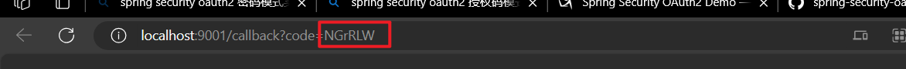

# SpringSecurity + Oauth2  授权码模式

参考

[Spring Security OAuth2 Demo —— 授权码模式 (Authorization Code) - 东北小狐狸 - 博客园 (cnblogs.com)](https://www.cnblogs.com/hellxz/p/oauth2_oauthcode_pattern.html#%E5%8F%97%E4%BC%97%E5%89%8D%E6%8F%90)

[SpringBoot+SpringSecurity+oAuth2+Redis实现简单授权认证-CSDN博客](https://blog.csdn.net/lux_yu/article/details/108389181)

### 授权服务器

​​

[authorization-code-demo.7z](assets/authorization-code-demo-20231003123738-p7qzanq.7z)

#### client_id存储在内存中

##### ​`AuthorizationConfig`​​配置

```java
import org.springframework.beans.factory.annotation.Autowired;
import org.springframework.context.annotation.Configuration;
import org.springframework.security.crypto.password.PasswordEncoder;
import org.springframework.security.oauth2.config.annotation.configurers.ClientDetailsServiceConfigurer;
import org.springframework.security.oauth2.config.annotation.web.configuration.AuthorizationServerConfigurerAdapter;
import org.springframework.security.oauth2.config.annotation.web.configuration.EnableAuthorizationServer;
import org.springframework.security.oauth2.config.annotation.web.configurers.AuthorizationServerSecurityConfigurer;

//授权服务器配置
@Configuration
@EnableAuthorizationServer //开启授权服务
public class AuthorizationConfig extends AuthorizationServerConfigurerAdapter {

    @Autowired
    private PasswordEncoder passwordEncoder;

    @Override
    public void configure(AuthorizationServerSecurityConfigurer security) throws Exception {
        //允许表单提交
        security.allowFormAuthenticationForClients()
                .checkTokenAccess("isAuthenticated()");
    }

    @Override
    public void configure(ClientDetailsServiceConfigurer clients) throws Exception {
        // @formatter: off
        clients.inMemory()
                .withClient("client-a") //客户端唯一标识（client_id）
                .secret(passwordEncoder.encode("client-a-secret")) //客户端的密码(client_secret)，这里的密码应该是加密后的
                .authorizedGrantTypes("authorization_code") //授权模式标识
                .scopes("read_user_info") //作用域
                .resourceIds("resource1") //资源id
                .redirectUris("http://localhost:9001/callback") //回调地址

                .and()
                    .withClient("testClient")
                .secret(passwordEncoder.encode("testSecret"))
                .authorizedGrantTypes("authorization_code")
                .scopes("test_scopes")
                .resourceIds("test_resource")
                .redirectUris("https://www.bilibili.com/");
        // @formatter: on
    }
}
```

##### 获取授权码

启动授权服务器

浏览器访问

[http://localhost:8080/oauth/authorize?client_id=testClient&amp;response_type=code&amp;redirect_uri=https://www.bilibili.com/](http://localhost:8080/oauth/authorize?client_id=testClient&amp;response_type=code&amp;redirect_uri=https://www.bilibili.com/ " ")	

参数参考​`AuthorizationConfig`​

​​​​

授权成功后会重定向到参数中的地址，地址参数中带有授权码

​​

​`redirect_uri`​可以不带上，如果参数与代码中的不匹配，就会出现如下界面

​​

##### 获取token（使用postman测试）

​​

​​

发送请求后获得了token

​​

‍

当前的用户密码是直接放在内存的，后续应该用其他方式

#### client_id jdbc方案

‍

pom.xml添加​`mysql-connector-java`​和​`spring-boot-starter-jdbc`​

‍

##### ​`application.yml`​​​配置

```yml
spring:
  datasource:
    type: com.zaxxer.hikari.HikariDataSource
    driver-class-name: com.mysql.cj.jdbc.Driver
    jdbc-url: jdbc:mysql://localhost:3306/oauth2?useUnicode=true&characterEncoding=utf-8&useSSL=false&serverTimezone=GMT%2B8&allowPublicKeyRetrieval=true
    username: root
    password: 2835
    hikari:
      minimum-idle: 5
      idle-timeout: 600000
      maximum-pool-size: 10
      auto-commit: true
      pool-name: MyHikariCP
      max-lifetime: 1800000
      connection-timeout: 30000
      connection-test-query: SELECT 1
```

‍

##### ​`AuthorizationConfig`​​​修改

```java
import org.springframework.boot.context.properties.ConfigurationProperties;
import org.springframework.boot.jdbc.DataSourceBuilder;
import org.springframework.context.annotation.Bean;
import org.springframework.context.annotation.Configuration;
import org.springframework.context.annotation.Primary;
import org.springframework.security.oauth2.config.annotation.configurers.ClientDetailsServiceConfigurer;
import org.springframework.security.oauth2.config.annotation.web.configuration.AuthorizationServerConfigurerAdapter;
import org.springframework.security.oauth2.config.annotation.web.configuration.EnableAuthorizationServer;
import org.springframework.security.oauth2.config.annotation.web.configurers.AuthorizationServerEndpointsConfigurer;
import org.springframework.security.oauth2.provider.ClientDetailsService;
import org.springframework.security.oauth2.provider.client.JdbcClientDetailsService;
import org.springframework.security.oauth2.provider.token.TokenStore;
import org.springframework.security.oauth2.provider.token.store.JdbcTokenStore;

import javax.sql.DataSource;

@Configuration
@EnableAuthorizationServer
public class AuthorizationConfig extends AuthorizationServerConfigurerAdapter {

    /**
     * 配置自定义数据源，覆盖spring security oauth2自带的
     *
     * @return
     */
    @Bean
    @Primary //有多个配置实现时指定要使用的配置
    @ConfigurationProperties(prefix = "spring.datasource") //指定自定义数据源
    public DataSource dataSource() {
        return DataSourceBuilder.create().build();
    }

    //给jdbc模式的TokenStore配置数据源处理token的存取
    @Bean
    public TokenStore jdbcTokenStore() {
        return new JdbcTokenStore(dataSource());
    }

    //给jdbc模式的ClientDetailsService 服务配置数据源处理client相关信息的存取，需要数据库提前有值才可取出比对
    @Bean
    public ClientDetailsService jdbcClientDetailsService() {
        return new JdbcClientDetailsService(dataSource());
    }

    //配置token的处理方式为jdbc模式
    @Override
    public void configure(AuthorizationServerEndpointsConfigurer endpoints) throws Exception {
        endpoints.tokenStore(jdbcTokenStore());
    }

    //配置client相关信息的处理方式为jdbc模式
    @Override
    public void configure(ClientDetailsServiceConfigurer clients) throws Exception {
        clients.withClientDetails(jdbcClientDetailsService());
    }
}
```

##### 创建数据库

```sql
create database if not exists oauth2;

use oauth2;

-- used in tests that use HSQL
create table oauth_client_details (
  client_id VARCHAR(256) PRIMARY KEY,
  resource_ids VARCHAR(256),
  client_secret VARCHAR(256),
  scope VARCHAR(256),
  authorized_grant_types VARCHAR(256),
  web_server_redirect_uri VARCHAR(256),
  authorities VARCHAR(256),
  access_token_validity INTEGER,
  refresh_token_validity INTEGER,
  additional_information VARCHAR(4096),
  autoapprove VARCHAR(256)
);

create table oauth_client_token (
  token_id VARCHAR(256),
  token BLOB,
  authentication_id VARCHAR(256) PRIMARY KEY,
  user_name VARCHAR(256),
  client_id VARCHAR(256)
);

create table oauth_access_token (
  token_id VARCHAR(256),
  token BLOB,
  authentication_id VARCHAR(256) PRIMARY KEY,
  user_name VARCHAR(256),
  client_id VARCHAR(256),
  authentication BLOB,
  refresh_token VARCHAR(256)
);

create table oauth_refresh_token (
  token_id VARCHAR(256),
  token BLOB,
  authentication BLOB
);

create table oauth_code (
  code VARCHAR(256), authentication BLOB
);

create table oauth_approvals (
	userId VARCHAR(256),
	clientId VARCHAR(256),
	scope VARCHAR(256),
	status VARCHAR(10),
	expiresAt TIMESTAMP,
	lastModifiedAt TIMESTAMP
);


-- customized oauth_client_details table
create table ClientDetails (
  appId VARCHAR(256) PRIMARY KEY,
  resourceIds VARCHAR(256),
  appSecret VARCHAR(256),
  scope VARCHAR(256),
  grantTypes VARCHAR(256),
  redirectUrl VARCHAR(256),
  authorities VARCHAR(256),
  access_token_validity INTEGER,
  refresh_token_validity INTEGER,
  additionalInformation VARCHAR(4096),
  autoApproveScopes VARCHAR(256)
);
```

数据库中的`client_secret`​是指定的加密方式生成的密文，有其明文对照

​

‍

##### 获取token

启动服务器，访问以下链接

[localhost:8080/oauth/authorize?client_id=testClient&amp;response_type=code](http://localhost:8080/oauth/authorize?client_id=testClient&response_type=code)

​​

postman获取token

​​

​​

​​

### 资源服务器

​​

[authorization-code.7z](assets/authorization-code-20231003152024-eir92kh.7z)

#### 获得token

访问（重定向地址省略了）

[http://localhost:8080/oauth/authorize?client_id=client-a&amp;response_type=code](http://localhost:8080/oauth/authorize?client_id=client-a&amp;response_type=code)

​​

​​

#### 请求资源

资源地址

​`http://localhost:8081/user/pplax`​

​​

​​

‍

‍

‍

‍
